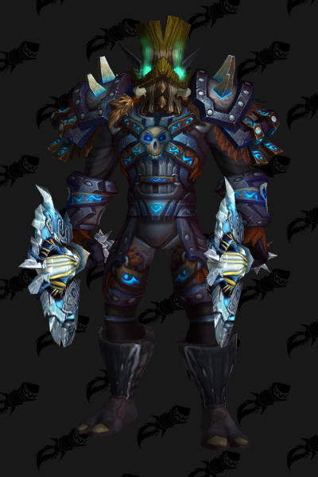
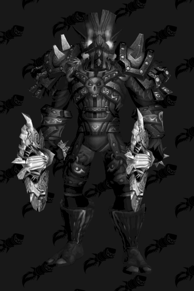

# ArmorSets-GAN

In this repository, I tried to create a Generative Adversarial Network (GAN) for generation of World of Warcraft images. In the images, there shall be new, not yet seen, so-called "transmogs" (outfits) for Zandalari Trolls race. I had this idea in my head for quite some time, and I finally took some time to spend on this project. This project is being actively worked on and is expected to be updated frequently. Let's get started.

## Introduction
In WoW, "transmog" is a "fashion style" that you apply to your character. Wearing different types of armor can (but don't have to) change your looks. There are specifically created "transmog sets" by the developers, which are usually intended to be well-matched together. Players, of course, experiment and often create nice and unique transmogs by combining several other transmog sets together. Note that a given item may or may not be a part of a transmog set. Since the process of creating a new, nice-looking outfit needs a bit of creativity and can be considered an art to some extent, why not use GANs to generate this art? I will not be creating combinations of existing transmogs per se, rather the network shall learn new pieces of armor that could potentially be added to the game.

If I had to specify a goal which I would like to achieve, it would be something as "Generate an image, that a casual player of WoW cannot undoubtedly distinguish between a fake and real picture. Casual player in this current context means, that he does not know all transmogs present in the game. Some people indeed know most of the transmogs, and if this person is really familiar with transmogs in game, they would easily decide whether a given image is fake or not. The generated character shall be a Zandalari Troll."

## Dataset
As with other machine learning problems, the most complicated part is often the data. For this project, I sat down and created my dataset from scratch. 
The main source of images was [WoWHead website](https://www.wowhead.com/). More specifically, I used their "outfits" section, where I applied a filter to look only for outfits that can be displayed on [**Zandalari Trolls**](https://www.wowhead.com/outfits/race:31/gender:0). All of these outfits were created by players (They are not sets per se), so most of them are indeed unique. For the sake of simplicity, I considered only **Male Zandalari Trolls**. This website has great potential for expanding the training dataset for other races, as well as other genders. I will be updating the dataset from time to time, whenever there is a good amount of new training examples on the website.

After applying this filter, I went through all the pages, displaying 1000 results of Zandalari Trolls outfits. From these 1000 results, I have omitted ie. sets that had only one piece of armor applied (ie. only boots on the whole character). For all other outfits displayed in the filter, I have opened the model in WoWHead's 3D viewer and used a simple PrintScreen (With a little help of Lightshot) to save the posture. All the models were adjusted in the 3D viewer to have a better look from the front. Since all has been done by hand, the position is not always the same, but that can never hurt a learning neural network :). This way, I have created a dataset of about 650 pure Zandalari Troll transmogs. Afterwards, I have also applied the same data generating process on transmog sets, which are named in the dataset as `<set_name>_ZT.png`. You may notice, that in the "dataset" folder, there are also images ending in `_G` and `_H`. These are again transmog sets, but this time on Gnomes and Humans. This is a relict of my initial enthusiasm and idea that I would generate this dataset for Zandalari Trolls as well as Gnomes and Humans. (But Gnomes and Humans are also used in the current state of the network, TBD)

During the generation of the dataset, I noticed that a transmog item `Xavius' Shoulders` was not displayed in the 3D viewer. Because of that, I have added a few images with the character wearing this item from different sources than the WoWHead database.

All in all, there are 971 training images of transmog sets, with 895 of them being Zandalari Trolls.

An example image from the dataset is the following. 

 

The first version of the dataset is available for [download](https://drive.google.com/file/d/1m38LDiNH5U9QnD2XNsa8EaUuJvYQZlTI/view?usp=sharing)

### Why Zandalari Trolls?
In my **subjective** opinion, Zandalari Trolls and Humans have the best body posture. If you are familiar with the races, for example, Trolls, or Orcs are usually stooped and look unnatural to me. Zandalari Trolls are also more muscular and greater in size than Humans. As they are the true alphas of the game, I decided to show my love for them this way.

## Environment
- Python 3.7.0
- Tensorflow 2.7.0
- tqdm 4.31.1
- opencv-python 4.5.4
- CUDA 11.5.1_496.13
- cuDNN v8.2.2 (July 6th, 2021), for CUDA 11.4 (cuDNN for 11.5 does not work)
- NVIDIA GeForce GTX 1060 & **NVIDIA GeForce RTX 2080**

It is recommended to use GPU or any other accelerator for training the network. Generation can probably be done on CPU, though expect it won't be instantly. For a guide on how to install TensorFlow for GPU, refer to [tensorflow-gpu installation guide](https://www.youtube.com/watch?v=hHWkvEcDBO0&ab_channel=AladdinPersson). The official documentation on how to install GPU support for TensorFlow is not clear.

## Model
The system, as with most other GANs, consists of two parts, a generator, which is responsible for generating an image from a latent vector of numbers, and a discriminator, which is responsible to distinguish real images (from the dataset) and fake images (generated by the generator). In general, these are two neural networks competing with each other to reach a "zero-sum" state, or, in Game Theory - Nash Equilibria. The discriminator takes inputs from both the training dataset and the generator, to improve its performance. The generator, on the other hand, learns from the discriminator. The loss from the discriminator tells the generator how to adjust the generated image in order to fool the discriminator.

Since I am working with RGB image inputs, both the discriminator and the generator are convolutional neural networks. The discriminator is a common CNN with no special features, while the generator is an "inverted" convolutional neural network, employing `Conv2DTranspose` (Transpose Convolution) operation, which enables the network to generate an image from a 1-dimensional vector.

The generator generates (And the discriminator takes as input) a (300x200) RGB image. Note that this also has an influence on the quality of the output, since although it is quite large image in the context of CNNs, for human eye it is still not good enough. For optimal performance, I would like to generate images of the same size that the training images are, which is around (1200x800), but training such network is very computationally demanding and currently not feasible in my home settings.

Taking a great inspiration in blogs about generating MNIST dataset using GANs (See sources section below), I had to adjust my architecture in a way that allowed the network to percieve larger features. This means enlarging the kernel sizes up to (13x13) and also adding more kernels per layer.

In my experiments, adding more filters (in the generator network) results in better generator outputs, but carries the risk of failure mode.

You can see the generator and discriminator model summary below.

<pre>
                     **GENERATOR**                                             **DISCRIMINATOR**
</pre>

  

## Results
### Before 3000 epochs
I have trained this model for 3000 epochs. The training took about 10 days (daytime, not training during the night) on an RTX 2080 GPU. If you are curious about the detailed process, you can see some of the outputs in the `img` folder, where examples of images are located. If they have a number prefix, that prefix specifies the epoch after which these images have been generated. Please note, that these images are not a representative example, they are cherry-picked by me, as I found them interesting and worth saving. For my personal evaluation, I have created 200 images from random vectors and tried to examine them personally and assess their quality. For example, after epochs 1050 and 1640,  some notable outputs have been generated. See below.

  |  

It is definitely noticeable, that these are not a very high-quality images, though given the complexity of the network and my computational resources, I consider it a very solid output. If these outputs would be sharpened up, I would consider my project a success.

After 2000th epoch, the learning rate has been lowered to `1/10` of the original learning rate. The quality of the generated images improved slightly, so at epoch 2700, I decided to lower the learning rate once again to `1/10` and finished the training to epoch 3000.

### After 3000 epochs
Since the training already took several days and further improvements were rather fuzzy, I decided to halt the training process until I either figure out a quality improvement, architectural improvement, or gain access to more powerful resources to continue experimenting.

My personal opinion on the performance of the generator after 3000 epochs is not astonishing. The generated images are mostly somewhat crippled and degenerated, though several solid outputs emerge. Feel free to see below and evaluate it yourself. I am not entirely amazed by the results, but I am also amazed what the network was able to achieve. I do not consider my project a success (yet), but I think it has been a very contributing experience.

     

More examples, with one bad example included can be found in `img` folder. Note that the bad examples really dominate across random latent vectors.

### More details (and some observations) on the results
#### Progress across epochs
1) **0-30 epochs** : The network learns that there should be `something` in the middle of the image. It generates colored spots, mostly located in the center part of an image. 
2) **30-300 epochs** : The network learns the shapes and a general idea how the body / armor should look like. It starts to guess more complex shapes.
3) **300+ epochs** : The network improves in a general way. It learns the color combinations, tries to improve the learned shapes, and tries to figure out more complex features - Troll toes, Troll face, etc.

#### Optimizations
I swept the internet for optimization methods, and I have employed the following:
  - ADAM optimizer in both discriminator and generator (GAN)
  - Adaptive learning rate (fixed schedule, multiply by `0.1` every 1000 epochs (this has been tweaked mostly manually, though)
  - `tanh` activation function in the last layer of generator model
  - Label smoothing & label noise
  - Adding noise to all inputs to the discriminator (both real data samples and generated samples are modified with random normally distributed noise)
  - GaussianNoise layers before each Conv2D operation in the discriminator
  - Dropout in discriminator
  - (Consider only Zandalari Trolls in the training dataset)

#### Thoughts
  - It seems like adding more filters in the last `Conv2DTranspose` layer of the generator enabled the model to learn more features (especially Zandalari troll face), though adding more filters slowed down the training process significantly. (None of this is suprising, just worth keeping in mind)
  - Increasing filters size in the last layers of the generator enables the network to generate "bigger" features, like zandalari troll face. Smaller kernels resulted in the generated image to be more fine-grained, but also the colours seemed more random. (See `img/250.png`)
  - Increasing filters size drastically influences training speed. As with other such optimizations, the generated image quality seems to be better with higher filter sizes. Higher filter sizes also call for more of those filters to be able to generate enough features, even further reducing the training efficiency.
  - Seems like the improvement I'd be looking for can be present in [DMM-GAN](https://assets.amazon.science/72/13/e2d786a34e3dbc4ae0056521bd45/detail-me-more-improving-gans-photorealism-of-complex-scenes.pdf). Since my images are quite complex (Naked / semi-naked / fully-armored, Wielding / not wielding a weapon, skirt / no skirt, helmet / no helmet, etc.), I think I could employ the same reasoning about the problem as authors of this paper. They consider living rooms being also complex problem (lamps? Sofas? Windows? TV?) Their solution is also even more computationally demanding and most likely not feasible at the moment.
  - Maybe attention could help?

## Sources
- [WoWHead website](https://www.wowhead.com/)
- [How to develop a generative adversarial network for an mnist handwritten digits from scratch in Keras](https://machinelearningmastery.com/how-to-develop-a-generative-adversarial-network-for-an-mnist-handwritten-digits-from-scratch-in-keras/)
- [Image generation in 10 minutes with generative adversarial networks](https://towardsdatascience.com/image-generation-in-10-minutes-with-generative-adversarial-networks-c2afc56bfa3b)
- [Tensorflow on GPU](https://www.tensorflow.org/guide/gpu)
- [10 Lessons I learned training GANs for a year](https://towardsdatascience.com/10-lessons-i-learned-training-generative-adversarial-networks-gans-for-a-year-c9071159628)
- [GAN hacks](https://github.com/soumith/ganhacks)
- Keras documentation for modifying layers
